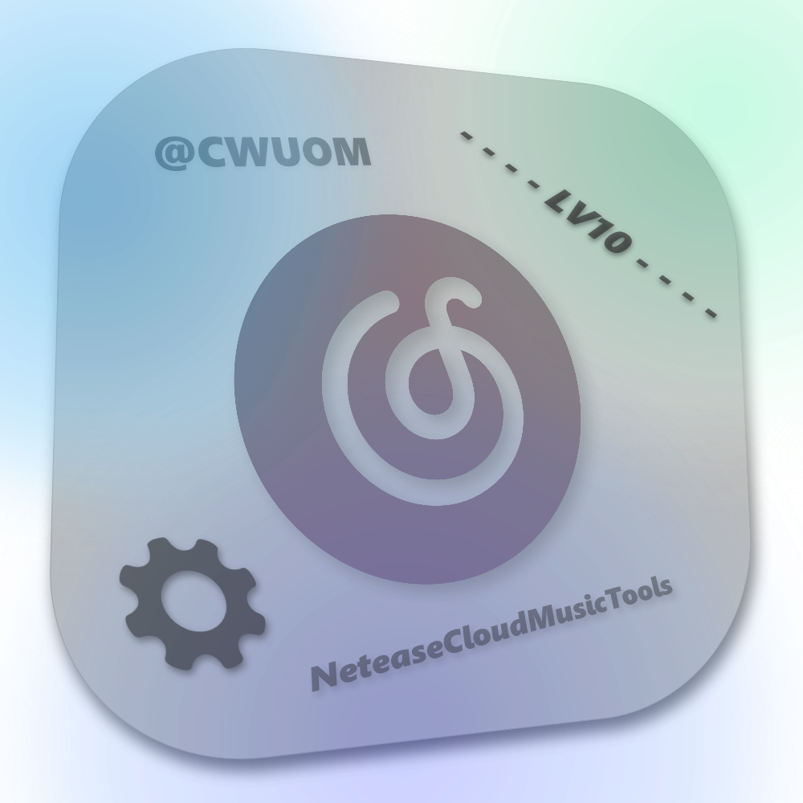

    

# **NeteaseCloudMusicTools**   - 网易云升级助手

NeteaseCloudMusicTools是一个可以在Windows平台上运行的全自动网易云刷等级脚本兼工具箱!

基于Python3.7编写

----

#### bilibili - im-cwuom 关注我获取更多!

------------

### 关于NeteaseCloudMusicTools
#### 功能方面
- 每天(9点)稳定300首 + 自动签到
- 刷单曲听歌量, 共三种模式, 其中模式二可在60s左右可达到100 - 1000+单曲听歌量增长
- 编辑 config.ini，可根据自己的升级需求来更改单独配置
- 刷到300首自动终止, 不占用多余带宽, 当听歌量无法满足时可以自动重试
- 自动启用api服务
- 下载歌曲 / 歌单 无损解析(VIP)
- 听歌量进度缓存，防止程序意外终止
- 直接使用现有 cookie 登录指定浏览器
- 配置文件损坏自动修复
- ...
------------
#### 登录方面 
- 支持qrlogin(扫码登录)自动获取cookie
- 支持调起多种主流浏览器(Chrome/Firefox/Edge/Safari)
- 当cookie失效时自动重新要求登录
------------
#### 效率方面
- 所有方案基本采用多线程
- LV9的账户 300 首刷满大约 3min 较低等级 1-2min 左右 

------------

#### 支持的平台
- 打包版本目前只支持windows，但源码可以复制到linux主机上(前提: 有py环境, 模块正常)

------------

#### 便携性/兼容性
- 操作简单，哪怕没有基础也可以快速部署，因为看见有人收费所以想着自己做了一个，但网上大多数升级工具(除收费，网站版)部署困难，但此程序已经整合了所需环境，双击打开就可运行
- 不兼容Windows 7或老架构的机器，测试环境Windows 11 专业版 22H2

------------

### 脚本截图

------------

## 声明
### 一切开发旨在学习，请勿用于非法用途
- 请勿作为商业用途
- 软件运行不会窃取你的cookie，分享时请注意cookie是否清空
